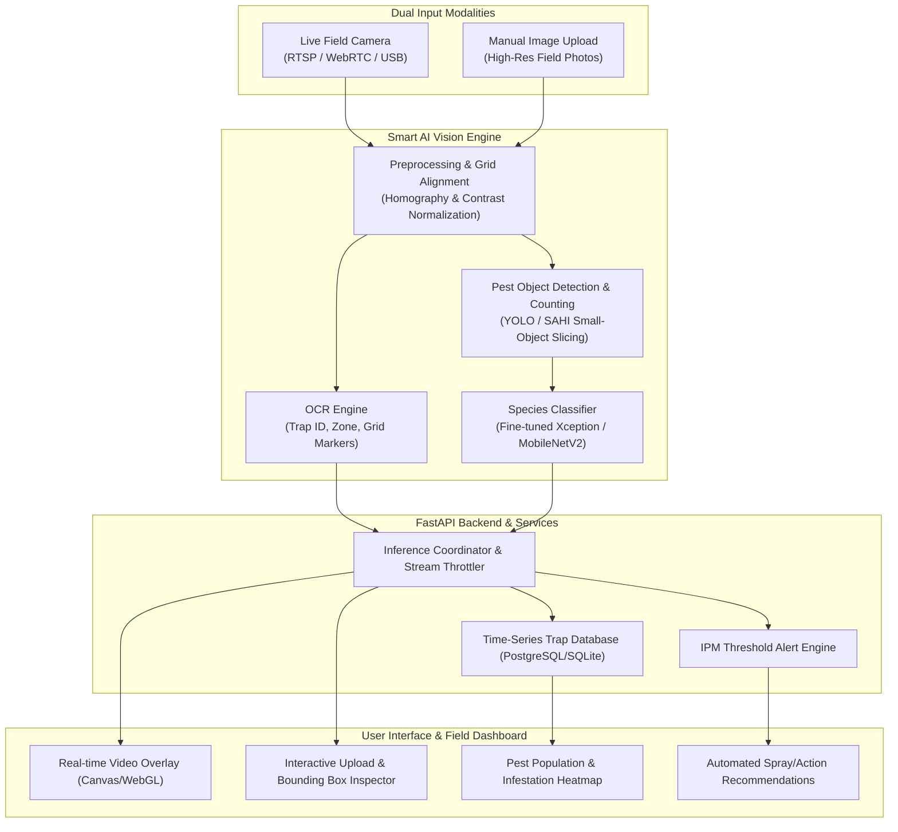
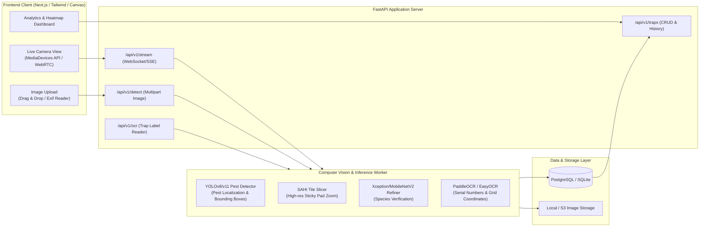
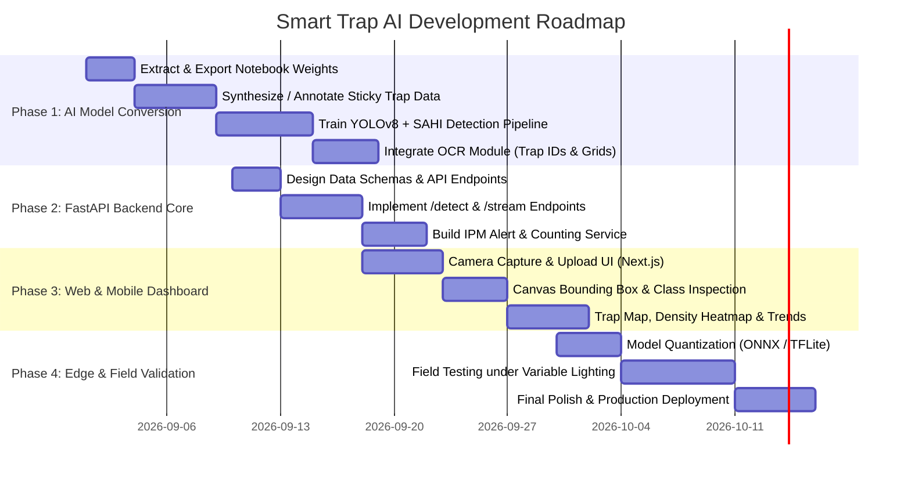

# Smart Trap AI for Pest Control: Comprehensive Implementation Plan

## 1. Executive Summary & Vision

This implementation plan outlines the architecture, roadmap, and technical specifications for transforming the foundational research in [`farm-insect-detection-transfer-learning.ipynb`](file:///home/fauzan/Projects/prof-dudi/farm-insect-detection-transfer-learning.ipynb) into an end-to-end **Smart Trap AI System for Precision Pest Control & IPM (Integrated Pest Management)**.

The system will empower farmers, agronomists, and greenhouse operators to:
1. **Detect & Count Multiple Pests Simultaneously** via dual input modalities:
   - **Live Camera Stream** (Edge IoT camera trap or smartphone/webcam).
   - **High-Resolution Image Upload** (Field photos of sticky pads, delta traps, or light traps).
2. **Perform OCR & Trap Metadata Recognition** to automatically read trap serial numbers, zone QR codes, grid coordinates, and date stamps.
3. **Generate Real-Time Infestation Heatmaps & Actionable IPM Alerts** when pest density crosses economic injury thresholds.



---

## 2. Current Project Analysis vs. Production Target

### 2.1 What the Current Notebook Provides
The notebook [`farm-insect-detection-transfer-learning.ipynb`](file:///home/fauzan/Projects/prof-dudi/farm-insect-detection-transfer-learning.ipynb) establishes:
- **15 Target Agricultural Classes**:
  1. *Citrus Canker*
  2. *Colorado Potato Beetles*
  3. *Fall Armyworms*
  4. *Cabbage Loopers*
  5. *Spider Mites*
  6. *Corn Borers*
  7. *Brown Marmorated Stink Bugs*
  8. *Corn Earworms*
  9. *Thrips*
  10. *Western Corn Rootworms*
  11. *Tomato Hornworms*
  12. *Armyworms*
  13. *Africanized Honey Bees (Killer Bees)*
  14. *Fruit Flies*
  15. *Aphids*
- **Model Evaluation**: Comparison between `ResNet50V2`, `ResNet152V2`, `MobileNetV2`, and `Xception`.
- **Hyperband Optimization**: Hyperparameter tuning on dense layers and learning rates, yielding `XceptionFarmInsectClassifier.h5` with ~256x256 input resolution.

### 2.2 Critical Gaps to Bridge for a Real-World Smart Trap

| Dimension | Notebook Baseline | Production Smart Trap AI Requirement |
| :--- | :--- | :--- |
| **Task Type** | Single-image classification (1 cropped insect per image) | **Multi-instance Object Detection & Density Counting** (dozens of tiny pests on a single sticky trap surface) |
| **Input Modality** | Static local image files | **Live Camera Feed (WebRTC/RTSP/USB)** + **High-Res Upload (Drag & Drop)** |
| **Small Object Handling** | Resized down to 256x256 (destroys small insect features like Thrips and Mites) | **SAHI (Slicing Aided Hyper Inference)** or High-Res Tile Detection (e.g., 640x640 / 1280x1280 tiles) |
| **Trap Identification** | None | **OCR Engine** (Reads Trap ID, QR tag, sticky board grid lines, date stamp) |
| **Deployment Engine** | Full Keras/TensorFlow runtime | **Quantized ONNX / TensorRT / TFLite** for low-latency edge and web inference |
| **Business Logic** | Static accuracy metrics | **IPM Threshold Alerts**, automated count history, economic threshold flags |

---

## 3. System Architecture & Component Design



### 3.1 AI Vision & Processing Modules

1. **Trap Surface Normalization & Homography**:
   - Detects the rectangular border of the sticky board / trap aperture.
   - Applies perspective warping to correct camera angle skew and ensure consistent physical millimeter-per-pixel scaling.
2. **OCR & Trap Marker Recognition**:
   - **Text Recognition**: Extracts Trap ID (e.g., `TRAP-A12-GREENHOUSE-03`), installation dates, or zone codes using **PaddleOCR** / **EasyOCR**.
   - **Barcode / QR Code Decoder**: Fast OpenCV `cv2.QRCodeDetector` / `pyzbar` for instant trap pairing.
   - **Grid Line Calibration**: Automatically counts pests by trap grid quadrant (e.g., A1 through D4).
3. **Two-Stage Pest Detection & Recognition**:
   - **Stage 1 (Localization)**: Fine-tuned `YOLOv8n` / `YOLOv11n` or SAHI sliced detector finds all insect bounding boxes across the trap surface.
   - **Stage 2 (Classification & Verification)**: Crops each detected pest and feeds it to the fine-tuned **Xception / MobileNetV2** classifier (leveraging the existing weights from the `.ipynb`) for 15-class precision identification with confidence scores.
4. **Tracking & Duplicate Suppression (for Live Video)**:
   - DeepSORT / ByteTrack ensures insects already trapped/counted on previous video frames are not double-counted as the camera stream runs.

---

## 4. Technology Stack

### Backend & AI Inference
- **Language**: Python 3.10+
- **Web Framework**: FastAPI (Asynchronous, high throughput, native OpenAPI docs)
- **Computer Vision**: OpenCV (`opencv-python-headless`), Pillow
- **Object Detection & Slicing**: Ultralytics YOLOv8/v11 + SAHI (`sahi`)
- **Classification Backbone**: TensorFlow / Keras 3 / ONNX Runtime (Xception / MobileNetV2)
- **OCR Engine**: `easyocr` or `paddleocr` + `pyzbar`
- **Task & Storage**: SQLite (development) / PostgreSQL with SQLAlchemy + Asyncpg

### Frontend & Field Dashboard
- **Framework**: Next.js 14 (App Router) or React 19 + Vite
- **Styling**: Tailwind CSS (Minimalist, responsive, high-contrast agricultural data visualization)
- **Camera & Stream**: HTML5 `navigator.mediaDevices.getUserMedia`, WebRTC / Canvas 2D overlay
- **Icons & Motion**: Phosphor Icons / Radix Icons, Framer Motion
- **State & Data Fetching**: TanStack Query (React Query) + Zustand

### Edge Hardware Deployment (Optional Field Traps)
- **Hardware Targets**: Raspberry Pi 4/5 + 12MP HQ Camera, Jetson Orin Nano, or ESP32-CAM (periodic upload mode).
- **Inference Runtime**: ONNX Runtime with CPU/NPU acceleration or TFLite INT8 Quantized.

---

## 5. Phase-by-Phase Implementation Roadmap



### Phase 1: Model Evolution & AI Pipeline (Weeks 1–2)
1. **Weight Extraction & Export**:
   - Convert the trained `XceptionFarmInsectClassifier.h5` to **ONNX format** (`xception_pest.onnx`) for portable, C++/Python inference.
2. **Dataset Augmentation & Detection Dataset Assembly**:
   - Collect or synthesize sticky trap background datasets with multiple pest annotations across the 15 classes.
   - Setup SAHI (Slicing Aided Hyper Inference) for high-resolution trap photos (e.g. 4000x3000 down to 512x512 overlapping slices).
3. **OCR Integration**:
   - Build `TrapOCRService` using EasyOCR/PaddleOCR to detect alphanumeric trap labels (e.g. "TRAP-01", "ZONE-B") and date stamps.

### Phase 2: FastAPI Backend Engine (Weeks 2–3)
1. **Endpoint Implementation**:
   - `POST /api/v1/detect`: Multipart upload accepting high-res images (`.jpg`, `.png`), returning detected insect boxes, species classification, counts per class, and OCR metadata.
   - `WebSocket /ws/v1/stream`: Real-time streaming endpoint for camera feeds with throttled FPS (e.g. 5–10 FPS) for live counting.
   - `POST /api/v1/ocr`: Dedicated endpoint to isolate and read trap identification tags.
2. **IPM (Integrated Pest Management) Rule Engine**:
   - Define threshold matrix (e.g. `Thrips > 20/trap/day` triggers Yellow Alert; `Fall Armyworm > 5` triggers Immediate Red Spray Alert).

### Phase 3: Modern Web Frontend & Field UI (Weeks 3–4)
1. **Dual Capture Interface**:
   - **Camera Mode**: Accesses device camera with auto-focus, bounding-box overlay directly rendered on an HTML5 `<canvas>`, and live pest counter HUD.
   - **Upload Mode**: High-resolution drag-and-drop zone with instant zoom/pan inspection, clickable bounding boxes showing class probabilities, and OCR tag verification.
2. **Analytics & Trap Management**:
   - Visual summary of species distribution (pie/bar charts), infestation trend over time, and sticky board saturation gauge (alerts when sticky pad is 80% full and needs replacement).

### Phase 4: Edge Optimization & Field Deployment (Weeks 4–5)
1. **Model Quantization**:
   - Convert models to INT8 / FP16 ONNX and TFLite for deployment on low-power devices.
2. **Field Robustness Testing**:
   - Calibrate for lighting glare, shadows on sticky pads, dirt/debris filtering, and insect overlap.

---

## 6. Detailed API & Data Contract

### 6.1 Inference Request & Response Schema

#### `POST /api/v1/detect`
**Request**: `multipart/form-data` with `file: Binary`, `trap_id: Optional[str]`, `enable_ocr: bool = true`.

**Response (JSON)**:
```json
{
  "status": "success",
  "trap_metadata": {
    "detected_trap_id": "TRAP-GREENHOUSE-04",
    "ocr_confidence": 0.94,
    "timestamp": "2026-09-01T10:30:00Z",
    "grid_quadrants_detected": 16
  },
  "summary": {
    "total_pests": 18,
    "species_counts": {
      "Thrips": 12,
      "Aphids": 4,
      "Fruit Flies": 2
    },
    "ipm_risk_level": "WARNING",
    "ipm_action_recommended": "Deploy predatory mites; monitor Zone 4 in 48h."
  },
  "detections": [
    {
      "id": "det_001",
      "class_name": "Thrips",
      "confidence": 0.96,
      "box_xyxy": [145.2, 310.4, 185.0, 350.1],
      "quadrant": "B2"
    },
    {
      "id": "det_002",
      "class_name": "Fruit Flies",
      "confidence": 0.91,
      "box_xyxy": [520.0, 680.1, 590.3, 750.5],
      "quadrant": "D3"
    }
  ],
  "processing_time_ms": 142.5
}
```

---

## 7. Recommended Project File Structure

```text
prof-dudi/
├── farm-insect-detection-transfer-learning.ipynb  # Original Kaggle Notebook
├── IMPLEMENTATION_PLAN.md                         # Plan in Project Root
├── backend/                                       # FastAPI Service
│   ├── app/
│   │   ├── api/
│   │   │   ├── v1/
│   │   │   │   ├── endpoints/
│   │   │   │   │   ├── detect.py                  # Single & Batch Detection
│   │   │   │   │   ├── stream.py                  # Live WebSocket/RTSP Stream
│   │   │   │   │   ├── ocr.py                     # Trap ID & Text Extractor
│   │   │   │   │   └── traps.py                   # Trap Management & Logs
│   │   │   │   └── api.py
│   │   ├── core/
│   │   │   ├── config.py                          # Settings & Paths
│   │   │   └── ipm_rules.py                       # Pest Threshold Logic
│   │   ├── models/                                # DB ORM Models (SQLAlchemy)
│   │   ├── schemas/                               # Pydantic Request/Response
│   │   └── services/
│   │       ├── pest_detector.py                   # YOLO + SAHI Pipeline
│   │       ├── pest_classifier.py                 # Xception/MobileNet ONNX
│   │       └── ocr_service.py                     # EasyOCR / PaddleOCR Module
│   ├── weights/
│   │   ├── xception_pest_classifier.onnx          # Exported Classifier
│   │   └── yolov8_pest_detector.pt                # Object Detection Weights
│   ├── requirements.txt
│   └── main.py
├── frontend/                                      # Next.js / Tailwind UI
│   ├── src/
│   │   ├── app/
│   │   │   ├── page.tsx                           # Main Dashboard
│   │   │   ├── live-camera/page.tsx               # Real-time Camera Feed
│   │   │   ├── upload/page.tsx                    # Image Upload & Analysis
│   │   │   └── traps/page.tsx                     # Trap Registry & Reports
│   │   ├── components/
│   │   │   ├── CameraStream.tsx                   # Live WebRTC/Canvas Feed
│   │   │   ├── BoundingBoxViewer.tsx              # Interactive Detection Canvas
│   │   │   ├── PestSummaryCard.tsx                # Metric & Alert Badges
│   │   │   └── OCRMetadataBadge.tsx               # Detected Trap Tag Badge
│   │   └── lib/
│   └── package.json
└── edge_device/                                   # Raspberry Pi / Jetson Node
    ├── capture_node.py                            # Frame Capture & Sync
    └── config.json
```

---

## 8. Immediate Next Steps

1. **Step 1: Export Notebook Model to ONNX/TFLite**:
   - Write a standalone script to load `XceptionFarmInsectClassifier.h5` and export it to an optimized ONNX model with fixed input shapes.
2. **Step 2: Build the Core Inference Service**:
   - Implement the `backend/app/services/` modules to support both bounding-box detection and classification.
3. **Step 3: Build the Frontend Prototype**:
   - Construct the Next.js camera capture and image upload interface with real-time bounding box rendering.
