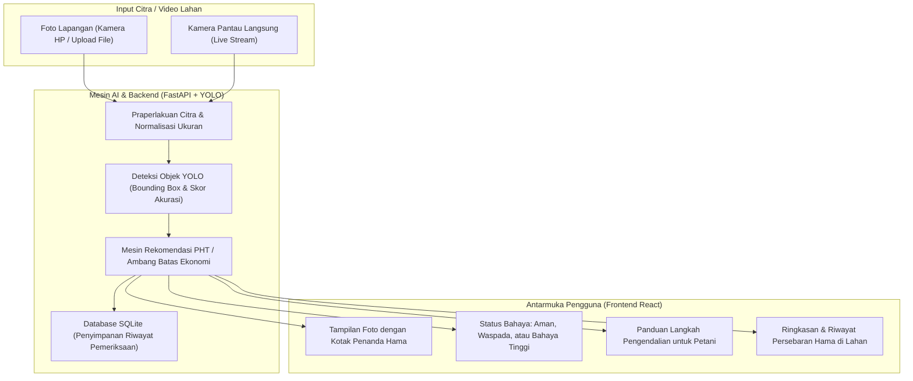

# Smart Trap Tanaman Jagung Pakan

Sistem Kecerdasan Buatan (AI) dan *Computer Vision* (YOLO) *End-to-End* untuk deteksi dini, pemantauan otomatis, dan rekomendasi Pengendalian Hama Terpadu (PHT / IPM) pada komoditas tanaman jagung pakan serta hama pengerat kebun.

---

## 🌽 Sasaran Hama Jagung Pakan & Hama Pengerat

Sistem ini dilatih secara terpadu menggunakan **8.300+ citra lapangan** untuk mengenali 4 hama perusak utama:

| Nama Hama (Indonesia) | Label Model / Dataset | Nama Ilmiah | Gejala & Bagian Tanaman yang Diserang |
| :--- | :--- | :--- | :--- |
| **Penggerek Batang Jagung** | `Asian-Corn-Borer` | *Ostrinia furnacalis* | Menggerek dan melubangi bagian dalam batang serta pangkal tongkol jagung. |
| **Ulat Tongkol Jagung** | `Bollworm` | *Helicoverpa armigera / zea* | Memakan rambut jagung dan merusak bulir biji jagung muda di dalam tongkol. |
| **Ulat Grayak Jagung** | `Fall-Armyworm` | *Spodoptera frugiperda* | Merusak daun pupus (*whorl*) dan pucuk jagung hingga berlubang besar. |
| **Hama Tikus Ladang / Sawah** | `Rat` | *Rattus spp.* | Merusak dan mengerat tongkol jagung matang, memotong pangkal batang, dan membuat lubang sarang di pematang kebun. |

---

## 🏗️ Arsitektur Sistem



---

## ✨ Fitur Utama

1. **Upload Foto Tanaman Jagung & Hama**:
   - Petani dapat mengunggah foto tongkol, batang, daun jagung, atau tikus langsung dari galeri HP atau komputer.
   - Pilihan melihat **Foto dengan Tanda Hama** atau **Foto Asli**.

2. **Kamera Pantau Langsung (Live Camera)**:
   - Menggunakan kamera ponsel atau *webcam* untuk memindai tanaman jagung dan hama secara *real-time*.
   - Menampilkan kotak penanda hama langsung di atas aliran video.
   - Tombol **"Simpan Catatan Foto Ini"** untuk menyimpan riwayat temuan ke sistem.

3. **Panduan Tindakan Pengendalian Ramah Petani (IPM)**:
   - Memberikan status yang jelas:
     - 🟢 **KONDISI AMAN**: Populasi hama nihil atau di bawah ambang batas ekonomi.
     - 🟡 **WASPADA**: Populasi hama mulai muncul, disarankan pelepasan musuh alami (*Trichogramma* / burung hantu), atau pembersihan pematang.
     - 🔴 **BAHAYA TINGGI**: Ambang kerusakan terlampaui, rekomendasi penyemprotan terarah (*Bacillus thuringiensis*) atau perangkap bubu TBS.

4. **Riwayat & Statistik Lahan**:
   - Menghitung total hama yang terpantau pada setiap titik lahan.
   - Grafik persentase persebaran jenis hama perusak jagung.

---

## 🚀 Panduan Memulai Cepat

### 1. Menjalankan Sekaligus (Bun Monorepo / Script)
Gunakan **Bun** dari root directory untuk menjalankan Backend & Frontend secara paralel:
```bash
bun dev
# atau
bun start
# atau
./start.sh
```

- **Dashboard Web Petani**: [http://localhost:5173](http://localhost:5173)
- **Dokumentasi API Backend (FastAPI Swagger)**: [http://localhost:8000/api/v1/docs](http://localhost:8000/api/v1/docs)

---

### 2. Menjalankan Layanan Secara Terpisah

#### Menjalankan Server Backend (FastAPI):
```bash
./run_backend.sh
```

#### Menjalankan Dashboard Frontend (React + Vite):
```bash
./run_frontend.sh
```

#### Menjalankan Pengujian Integrasi Otomatis:
```bash
PYTHONPATH=. backend/venv/bin/python backend/tests/test_backend.py
```

---

## 🧠 Melatih Ulang Model YOLO

Jika Anda menambahkan gambar atau dataset baru:
```bash
PYTHONPATH=. backend/venv/bin/python backend/train_yolo.py
```
Bobot model terbaik akan otomatis disimpan ke dalam `backend/weights/corn_pest_yolo.pt`.
